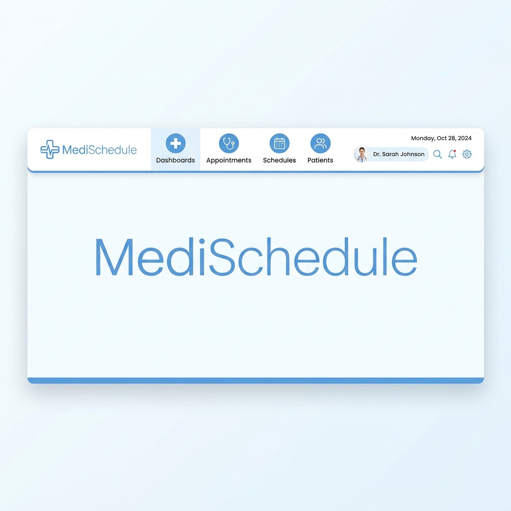

# 🏥 MediSchedule - Hệ thống Quản lý Đặt lịch Khám bệnh & Tư vấn AI Toàn diện



> **MediSchedule** là một nền tảng quản lý y tế thông minh, tích hợp trí tuệ nhân tạo (AI Triage) để tối ưu hóa quy trình kết nối giữa bệnh nhân và bác sĩ. Hệ thống được xây dựng theo kiến trúc hiện đại, đáp ứng đầy đủ các nghiệp vụ từ đặt lịch, khám trực tuyến đến quản lý bệnh án điện tử.

[](https://github.com/KLTN-GR50/KLTN_06-2026)
[](https://reactjs.org/)
[](https://nodejs.org/)
[](https://www.mysql.com/)
[](https://deepmind.google/technologies/gemini/)

---

## 📑 Tài liệu Hệ thống (System Documentation)

Hệ thống được thiết kế dựa trên các bộ quy tắc nghiệp vụ chặt chẽ:
- [Quy trình nghiệp vụ chi tiết (Functional Specs)](./bang_chuc_nang.md)
- [Yêu cầu hệ thống & Logic nghiệp vụ](./SYSTEM_REQUIREMENTS.md)
- [Báo cáo cấu trúc Database](./database_schema_report.md)
- [Danh sách tài khoản thử nghiệm](./TAI_KHOAN_DANG_NHAP.md)

---

## 🧠 Logic Nghiệp vụ Cốt lõi (Core Business Logic)

### 1. Xác thực & Phân quyền (RBAC)
Hệ thống sử dụng cơ chế **Role-Based Access Control (RBAC)** với 5 nhóm đối tượng:
- **Khách (Guest)**: Chỉ truy cập giao diện công cộng.
- **Bệnh nhân (Patient)**: Quản lý lịch hẹn cá nhân và tư vấn AI.
- **Bác sĩ (Doctor)**: Quản lý ca khám, chuyên môn và bệnh án.
- **Nhân viên (Staff)**: Điều phối vận hành, tiếp nhận tại quầy và hỗ trợ kỹ thuật.
- **Quản trị viên (Admin)**: Quản trị hệ thống, nhân sự và báo cáo tài chính.

### 2. Quy tắc Đặt lịch & Khám bệnh
- **Slot Management**: Lịch hẹn được chia theo khung giờ (Time Slots). Mỗi khung giờ có giới hạn số lượng bệnh nhân (`SoLuongToiDa`).
- **Trạng thái lịch hẹn**: `CHO_XAC_NHAN` → `DA_XAC_NHAN` → `DA_HOAN_THANH` / `VANG_MAT`.
- **Chính sách hủy lịch**: Việc hủy/đổi lịch phải tuân thủ quy tắc thời gian (ví dụ: trước 2 giờ).

### 3. Trí tuệ Nhân tạo (AI Triage Logic)
- **Cơ chế**: Sử dụng mô hình **Gemini Flash** để phân tích triệu chứng tự nhiên của bệnh nhân.
- **Output**: Gợi ý mức độ ưu tiên (Normal/Urgent), chuyên khoa phù hợp và danh sách bác sĩ liên quan.
- **Oversight**: Mọi kết quả tư vấn AI đều được lưu vết để Admin/Bác sĩ kiểm duyệt và đánh giá độ chính xác.

---

## ✨ Các Module Chức năng Chi tiết

### 🌐 Giao diện Công cộng (Public)
1. **Landing Page**: Giới thiệu dịch vụ, tìm kiếm bác sĩ/cơ sở y tế.
2. **Hệ thống Tìm kiếm**: Lọc theo chuyên khoa, kinh nghiệm, đánh giá và vị trí.
3. **Đặt lịch Nhanh (Fast Booking)**: Cho phép khách vãng lai đặt lịch mà không cần đăng ký tài khoản rườm rà.

### 👤 Module Bệnh nhân (Patient)
- **Dashboard**: Theo dõi nhắc lịch, thống kê cá nhân.
- **AI Consultation**: Chat tư vấn triệu chứng, nhận định chuyên khoa.
- **Telemedicine**: Video Call tích hợp trực tiếp (Jitsi SDK) cho các ca khám từ xa.
- **E-Health Record**: Xem toa thuốc, kết quả xét nghiệm và lịch sử khám bệnh.

### 👨‍⚕️ Module Bác sĩ (Doctor)
- **Schedule Management**: Tùy chỉnh khung giờ rảnh, thiết lập ngày nghỉ.
- **Consultation Room**: Giao diện khám bệnh chuyên nghiệp (Video + Ghi chú y khoa + Kê đơn).
- **AI Support**: Xem tóm tắt chẩn đoán AI của bệnh nhân trước khi khám.

### 🏢 Module Tiếp tân & Vận hành (Staff)
- **Triage Queue**: Giám sát hàng chờ bệnh nhân, ưu tiên các ca AI đánh giá "Cấp cứu".
- **Offline Booking**: Hỗ trợ đặt lịch trực tiếp tại quầy hoặc qua điện thoại.
- **Payment Support**: Thu phí mặt, xác nhận hóa đơn cho bệnh nhân khám tại chỗ.

### ⚙️ Module Quản trị (Admin)
- **User Management**: Phê duyệt hồ sơ bác sĩ, quản lý trạng thái tài khoản.
- **Financial Analytics**: Thống kê doanh thu theo ngày/tháng/chuyên khoa, heatmap hoạt động.
- **System Settings**: Cấu hình thông tin bệnh viện, quản lý các nội dung hiển thị trên Landing Page.

---

## 🛠 Công nghệ & Kiến trúc (Tech Stack)

| Lớp | Công nghệ | Chi tiết |
| :--- | :--- | :--- |
| **Frontend** | React 18 | Vite, Tailwind CSS, Shadcn UI, Framer Motion |
| **Backend** | Node.js (Express) | Sequelize ORM, JWT, Socket.io |
| **Database** | MySQL 8.0 | Quan hệ chặt chẽ (30+ bảng), tối ưu hóa Index |
| **AI/ML** | Gemini API | Flash 2.5, Prompt Engineering |
| **Video/Comm** | Jitsi SDK | WebRTC truyền tải chất lượng cao |

---

## 📊 Sơ đồ Dữ liệu & Mối quan hệ (Data Logic)

Hệ thống quản lý hơn **30 bảng dữ liệu** với các mối quan hệ thực thể chặt chẽ:

### 1. Phân cấp Người dùng & Phân quyền
- **NguoiDung ↔ VaiTro**: Quan hệ n-n (Many-to-Many). Một người có thể có nhiều vai trò (ví dụ: Bác sĩ kiêm Trưởng khoa).
- **BacSi ↔ ChuyenKhoa**: Một bác sĩ thuộc về một chuyên khoa cụ thể.
- **BenhNhan ↔ NguoiDung**: Quan hệ 1-1. Mở rộng thông tin y tế cho tài khoản người dùng.

### 2. Luồng Nghiệp vụ Đặt lịch
- **LichKham**: Chứa các "Slot" thời gian của Bác sĩ.
- **DatLich**: Kết nối `BenhNhan` và `LichKham`. Đây là bảng trung tâm điều hướng luồng thanh toán và khám bệnh.
- **HoSoBenhAn**: Được tạo ra sau khi `DatLich` hoàn thành, liên kết với `DonThuoc` và `ChiTietDonThuoc`.

### 3. Hệ thống Giao tiếp & AI
- **AITuVanPhien**: Lưu trữ toàn bộ hội thoại của một phiên tư vấn AI.
- **Conversation ↔ Message**: Quản lý tin nhắn giữa Bệnh nhân - Bác sĩ hoặc Bệnh nhân - Nhân viên hỗ trợ.
- **SupportCase**: Quản lý các ticket hỗ trợ kỹ thuật cho bệnh nhân.

---

## 🚀 Hướng dẫn Cài đặt & Khởi chạy

### 1. Yêu cầu Hệ thống
- Node.js >= 18.x
- MySQL Server >= 8.0
- Internet connection (để kết nối Gemini API)

### 2. Cài đặt Phụ thuộc
```bash
# Tại thư mục gốc (Root)
npm run install:all
```

### 3. Thiết lập Cơ sở dữ liệu
Hệ thống sử dụng script tự động để khởi tạo:
1. Tạo Database: `CREATE DATABASE database_benhvien;`
2. Chạy file batch để import dữ liệu mẫu (31 bảng):
```bash
./import_db.bat
```

### 4. Cấu hình Biến môi trường (.env)
Tạo file `.env` trong thư mục `backend/` và `frontend/` dựa trên các file `.env.example`. Đảm bảo cung cấp:
- `DB_PASS`: Mật khẩu MySQL của bạn.
- `GEMINI_API_KEY`: Key từ Google AI Studio.

### 5. Khởi chạy Ứng dụng
```bash
# Chạy toàn bộ hệ thống (Frontend + Backend)
./run_local.bat
```
- **Frontend**: [http://localhost:3050](http://localhost:3050)
- **Backend API**: [http://localhost:8001](http://localhost:8001)

---

## 🔒 An toàn & Bảo mật Dữ liệu
- **Data Encryption**: Mật khẩu được mã hóa bằng `bcrypt`.
- **JWT Authentication**: Bảo mật các phiên làm việc và API.
- **Audit Logs**: Ghi lại lịch sử thay đổi các thiết lập quan trọng của hệ thống.
- **Medical Privacy**: Tuân thủ các nguyên tắc bảo mật thông tin bệnh án y khoa.

---
**Phát triển bởi MediSchedule Team ❤️**
